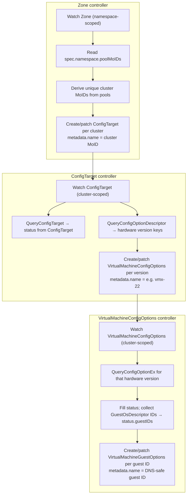
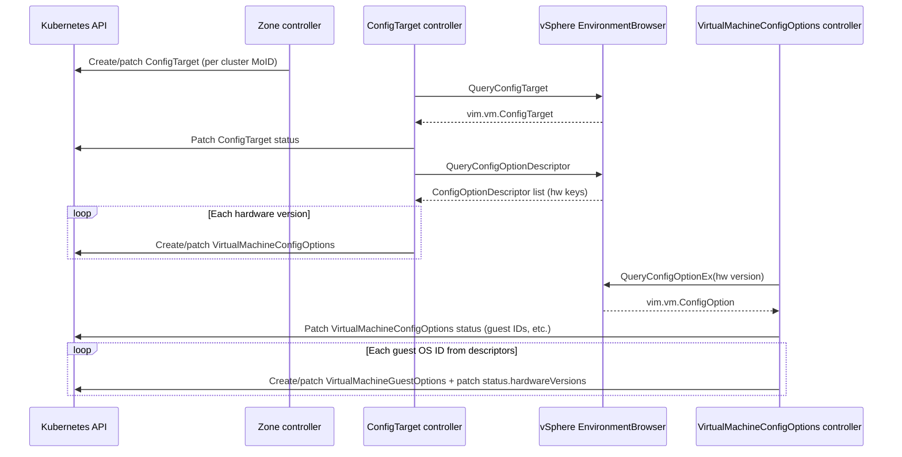

# Controller workflows

This document describes how zone discovery fans out into cluster-scoped config metadata and guest option resources. The pipeline is **Zone → ConfigTarget → VirtualMachineConfigOptions → VirtualMachineGuestOptions**.

## End-to-end flow

Each `VirtualMachineGuestOptions` reconciliation updates `status.hardwareVersions` with one entry for the hardware version of the `VirtualMachineConfigOptions` being reconciled; reconciles of other hardware versions append their own entries (see step 10).

## vSphere API and Kubernetes writes

## Controllers

### `Zone` controller

1. `Zone` controller watches `Zone` resources in a namespace.
2. When `Zone` object is reconciled, its `spec.namespace.poolMoIDs` list is inspected to get a list of the resource pool IDs belonging to the zone.
3. A unique set of vSphere cluster managed object IDs is derived from the list of the zone's pool IDs.
4. For each of the unique cluster managed object IDs, the Zone controller creates or patches a cluster-scoped `ConfigTarget` resource with the `metadata.name` of the resource being the managed object ID of the cluster.

### `ConfigTarget` controller

1. The new `ConfigTarget` controller watches for the `ConfigTarget` resources. Upon seeing a `ConfigTarget` resource, the controller calls [`QueryConfigTarget`](https://developer.broadcom.com/xapis/vsphere-web-services-api/latest/vim.EnvironmentBrowser.html#queryConfigTarget) on the cluster's environment browser. The controller uses the [result](https://developer.broadcom.com/xapis/vsphere-web-services-api/latest/vim.vm.ConfigTarget.html) to populate the `ConfigTarget`'s status information.
2. The new `ConfigTarget` controller also calls the [`QueryConfigOptionDescriptor`](https://developer.broadcom.com/xapis/vsphere-web-services-api/latest/vim.EnvironmentBrowser.html#queryConfigOptionDescriptor) API, getting a list of the hardware versions supported by the cluster (the [`key`](https://developer.broadcom.com/xapis/vsphere-web-services-api/latest/vim.vm.ConfigOptionDescriptor.html#key) field).
3. For each hardware version, the `ConfigTarget` controller creates or patches a cluster-scoped `VirtualMachineConfigOptions` resource, with its `metadata.name` field being the hardware version, ex. vmx-22.

### `VirtualMachineConfigOptions` controller

1. The new `VirtualMachineConfigOptions` controller watches the new, cluster-scoped `VirtualMachineConfigOptions` API. Upon seeing a `VirtualMachineConfigOptions` resource, the controller calls [`QueryConfigOptionEx`](https://developer.broadcom.com/xapis/vsphere-web-services-api/latest/vim.EnvironmentBrowser.html#queryConfigOptionEx) using the hardware version the `VirtualMachineConfigOptions` object represents.
2.  Using the [result](https://developer.broadcom.com/xapis/vsphere-web-services-api/latest/vim.vm.ConfigOption.html) of this call, the `VirtualMachineConfigOptions` controller fills in the status of the `VirtualMachineConfigOptions` object. However, for each of the `ConfigOption` result's `GuestOsDescriptors`, only the ID is used (after being converted to the CRD format of the ID). All the guest IDs are placed in the `VirtualMachineConfigOptions` object's `status.guestIDs` field.
3. For each guest ID, the `VirtualMachineConfigOptions` controller creates/patches a `VirtualMachineGuestOptions` object, with the `metadata.name` value being the DNS-safe version of the guest ID. The object's spec includes the guest ID. The controller fills out the object's status and updates its `status.hardwareVersions` listMap with the information for the hardware version represented by the `VirtualMachineConfigOptions` object being reconciled. Please note, this will mean filling out only a single element in the `status.hardwareVersions` list map, since other entries are populated when the `VirtualMachineConfigOptions` controller reconciles `VirtualMachineConfigOptions` objects representing other hardware versions.
